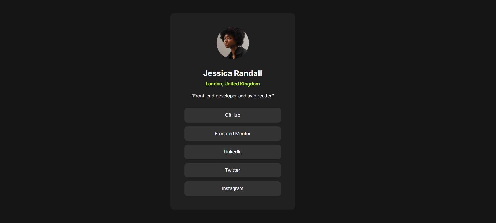

# Frontend Mentor - Solução do desafio Social links profile 

Essa é uma solução do [desafio Social links profile, do Frontend Mentor](https://www.frontendmentor.io/challenges/social-links-profile-UG32l9m6dQ). 

## Tópicos

- [Visão Geral](#visao-geral)
  - [O desafio](#o-desafio)
  - [Captura de tela](#captura-de-tela)
  - [Links](#links)
- [Meu processo](meu-processo)
  - [Construído com](#contruido-com)
  - [O que aprendi](#o-que-aprendi)
  - [Colaboração IA](#colaboracao-ia)

## Visão Geral

### O desafio

Os usários devem conseguir:

- Ver os estados dos elementos interativos ao passar o cursor sobre.

O desenvolvedor deve conseguir:
- Trabalhar diferentes versões, pensando em um versionamento de código profissional.

### Captura de tela




### Links

- URL da solução: [https://github.com/guerreiro-diassis/fmc-social-links-profile]
- URL do site: [https://guerreiro-diassis.github.io/fmc-social-links-profile/]

## Meu processo

### Built with

- Tags HTML5 semânticas
- Propriedades CSS customizadas
- Flexbox

### O que aprendi

Revisitei alguns estudos superficialmente em flexbox para centralizar o card. Entretanto, preferi modificar o espaçamento da maioria dos elementos a partir das margens, com o margin. 

A maior parte do estudo se dá, na verdade, no estudo de versionamento de código. Você pode conferí-lo através do histórico de versões deste desafio.

Durante o desenvolvimento, tirei algumas dúvidas pontuais de CSS com apoio de IA, que anotei abaixo para referência futura.

### Colaboração IA

Durante esse desafio, usei IA para tirar dúvidas específicas de CSS. Resumo do que revisei:

**Variáveis (Custom Properties)**
Declaradas em `:root` com `--nome-da-variavel: valor;` e usadas com `var(--nome-da-variavel)`. Podem ter fallback: `var(--cor, black)`. Também podem ser escopadas dentro de qualquer seletor (útil para temas claro/escuro).

**.gitignore**
Usa padrões simples: `arquivo.txt` ignora um arquivo específico, `pasta/` ignora uma pasta inteira, `*.log` ignora por extensão, e `!importante.log` cria uma exceção. Se o arquivo já foi commitado antes, é preciso rodar `git rm --cached arquivo` para parar de rastreá-lo.

**@font-face com múltiplos pesos**
Usa o mesmo `font-family` em todos os blocos, variando apenas o `font-weight` (e `font-style`, se houver itálico). O navegador escolhe o arquivo certo automaticamente conforme o peso pedido no CSS.

**Flexbox — direção e centralização**
`flex-direction: column` empilha os itens verticalmente (o padrão é `row`, horizontal). Para centralizar um elemento vertical e horizontalmente:
```css
.container {
    display: flex;
    justify-content: center; /* horizontal */
    align-items: center;     /* vertical */
    height: 100vh;           /* precisa de altura definida */
}
```

**Flexbox — valores de `justify-content`**
`flex-start`/`flex-end`/`center` agrupam os itens; `space-between` deixa espaço só entre os itens; `space-around` deixa espaço ao redor de cada item (borda = metade); `space-evenly` deixa espaço igual em tudo, incluindo as bordas.

**Centralizar com `margin: 0 auto`**
Centraliza apenas na horizontal. Exige `display: block` e uma `width` menor que a do elemento pai.

**Colapso de margem (margin collapse)**
Quando um elemento é o primeiro filho de um container, o `margin-top` dele pode "vazar" para fora do pai em vez de aplicar o espaçamento internamente. Resolvi um caso assim durante o desafio ajustando o container pai.